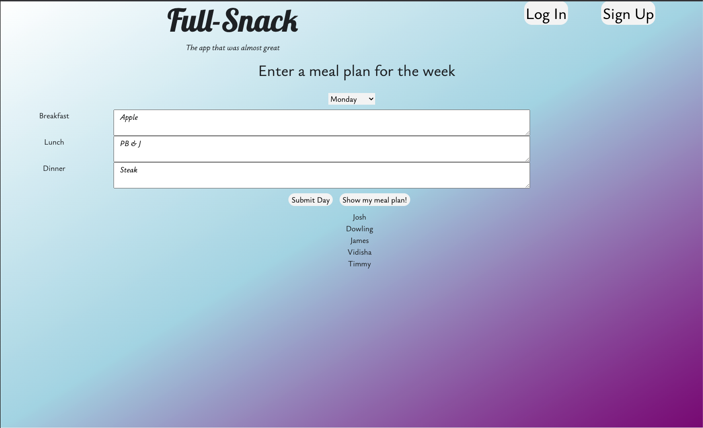

# Full-Snack Wellness App

## Deployed APP

https://gt-wellness-app.herokuapp.com/

## Github Repo

https://github.com/Juebele/Wellness-App

## Who We Are

Full-Snack is an application dedicated to changing the way individuals approach their health and wellness. By offering a comprehensive meal tracking platform, Full-Snack empowers users to take control of their dietary habits by making informed decisions about their meals. We understand that maintaining a balanced and nutritious diet can be a challenge in today's fast-paced world, so, our mission is to simplify the process by providing users with a user-friendly and intuitive platform that seamlessly integrates into their daily routines.

## Our Why

This app was created as a means to practice and showcase our full-stack web development skills. Through the implementation of a polished UI, utilization of multiple API routes, and incorporation of new technologies, we aimed to demonstrate our ability to build an enterprise-level application. This project served as a platform to demonstrate our ability to create user-friendly interfaces, handle complex data interactions, and adapt a new technology.

## How does it work?

This app makes use of advanced Javascript, npm packages, and databases. Our app uses a database to keep track of users, their meal plans, and their workout plans. This data is then populated dynamically using handlebars files to create a page that's unique to each user. All of the API routes are done with a series of .js files that use proper MVC principles to compartmentalize code.

## Dependencies

All required packages are listed in the included package.json file. Simply run "npm install" in the terminal to install all of the required packages.

## License

>[MIT](https://choosealicense.com/licenses/mit/)
